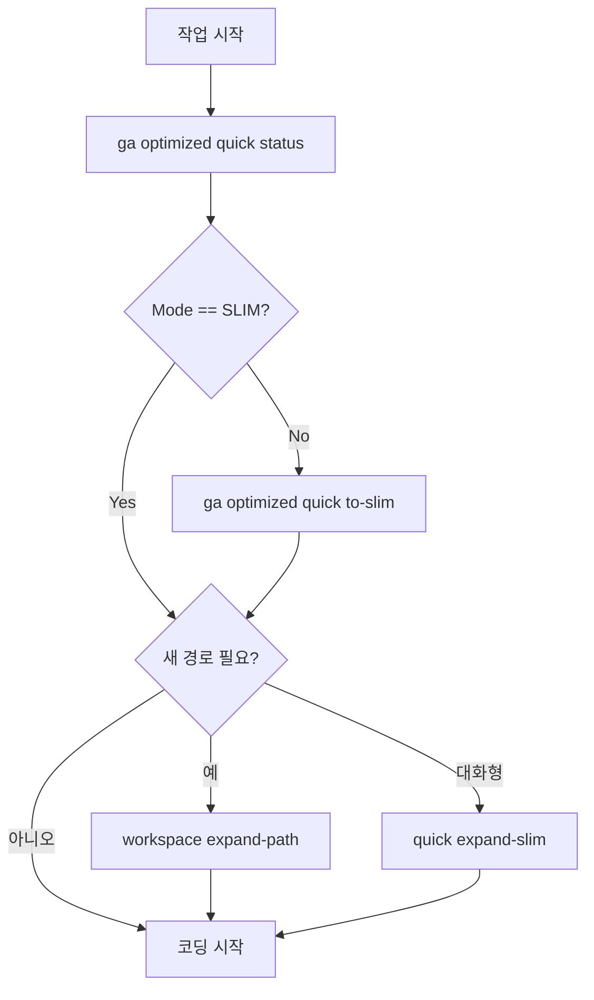
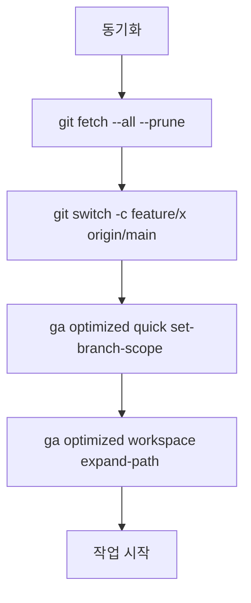
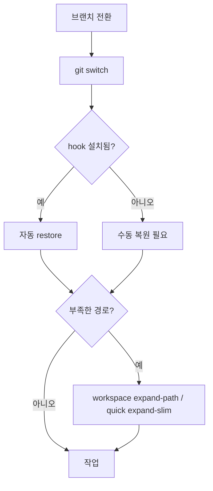
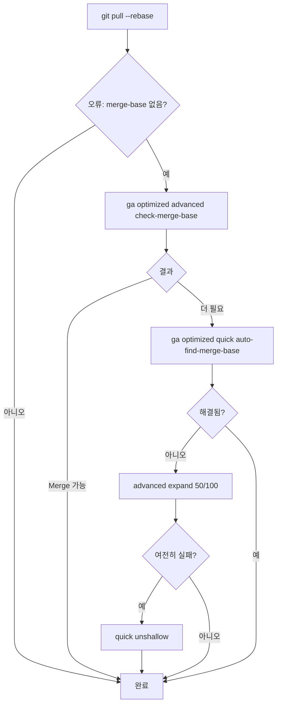
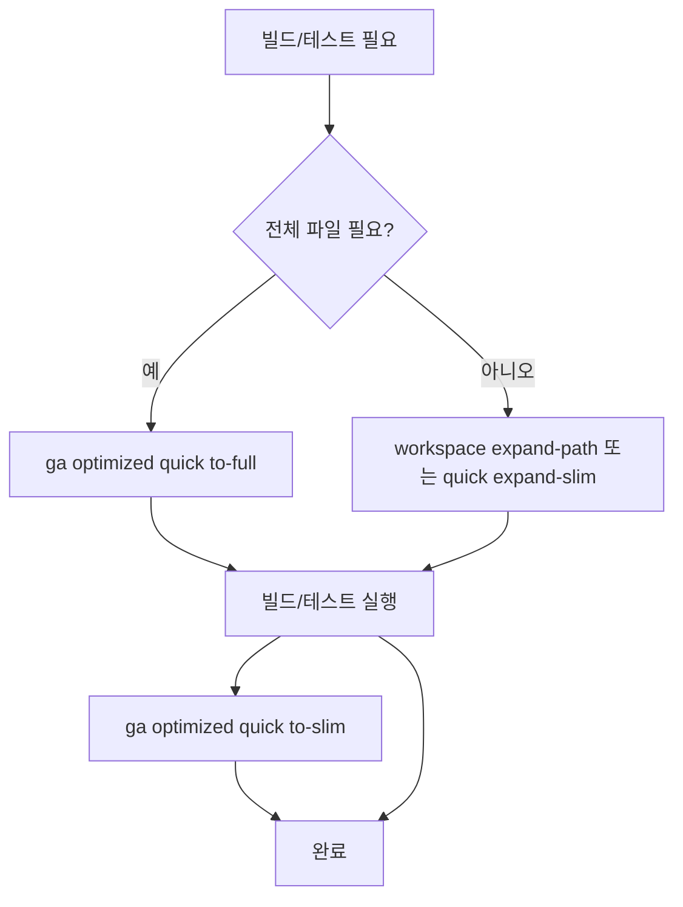
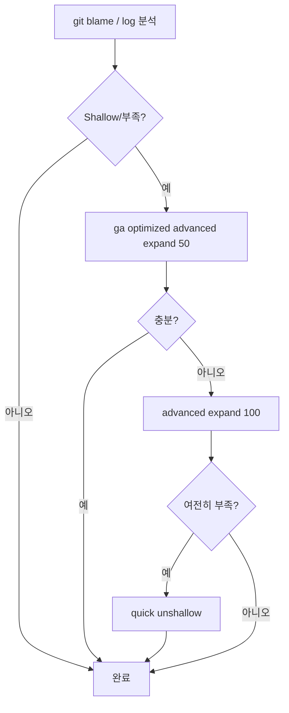
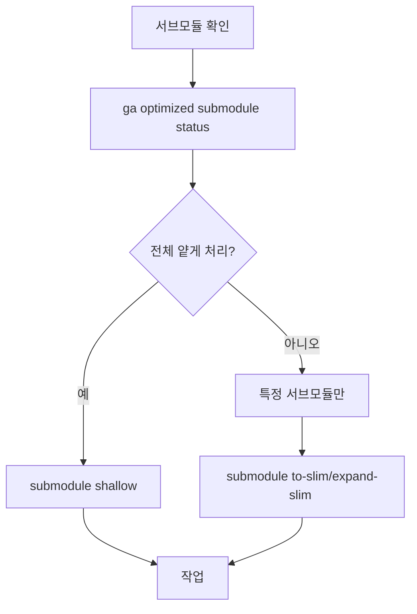
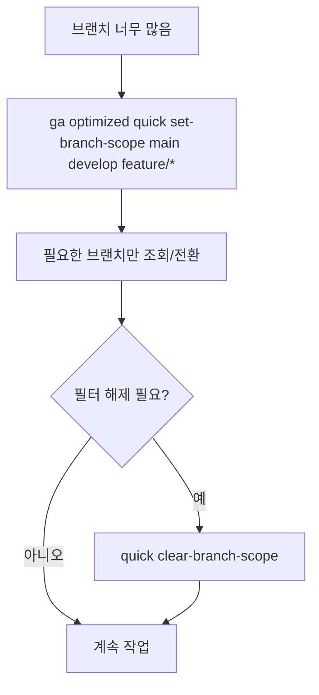
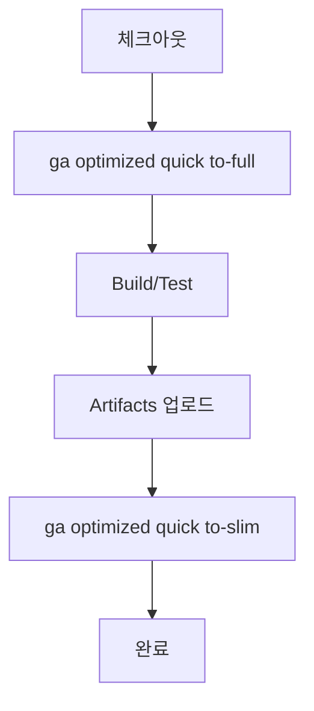
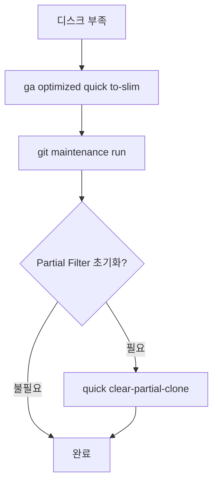

# Git 저장소 최적화 가이드

> WorkingCli의 Git 최적화 명령어로 대용량 저장소를 효율적으로 관리하세요
> 
> **핵심 성과**: 103GB 저장소를 30MB로 축소 (99.97% 절감)

## 🚀 Quick Start (5분 안에 시작하기)

### 처음 사용자를 위한 3단계 가이드

```bash
# 1. 현재 상태 확인
ga optimized quick status

# 2. 저장소 최적화 모드 전환
ga optimized quick to-slim

# 3. 필요한 경로만 확장
ga optimized workspace expand-path src/
```

## 🏆 핵심 워크플로우 TOP 10 (실사용 빈도 기준)

### 1️⃣ 일일 시작: 상태 확인 → 최적화 → 확장 ⭐⭐⭐⭐⭐
**시나리오**: 매일 작업 시작 시 저장소 상태 확인 및 필요 파일 준비



**명령어 예시**:
```bash
ga optimized quick status
# FULL 모드라면
ga optimized quick to-slim
# 필요한 경로 추가
ga optimized workspace expand-path src/components/
```

---

### 2️⃣ 기능 브랜치 시작 ⭐⭐⭐⭐⭐
**시나리오**: 새 기능 개발을 위한 브랜치 생성 및 작업 환경 설정



**명령어 예시**:
```bash
git fetch --all --prune
git switch -c feature/auth origin/main
ga optimized quick set-branch-scope src/auth/ src/components/auth/
ga optimized workspace expand-path src/auth/
```

---

### 3️⃣ 브랜치 전환 + 작업공간 복원 ⭐⭐⭐⭐⭐
**시나리오**: 브랜치 전환 시 해당 브랜치에 필요한 파일만 자동 로드



**명령어 예시**:
```bash
git switch feature/frontend
# Hook이 없다면 수동으로
ga optimized workspace expand-path src/frontend/
```

---

### 4️⃣ 풀/리베이스 Shallow 저장소 처리 ⭐⭐⭐⭐
**시나리오**: Shallow 저장소에서 병합 작업 시 히스토리 부족 문제 해결



**명령어 예시**:
```bash
git pull --rebase
# 오류 발생 시
ga optimized advanced check-merge-base
ga optimized quick auto-find-merge-base
# 여전히 부족하면
ga optimized advanced expand 50
# 최후의 수단
ga optimized quick unshallow
```

---

### 5️⃣ 빌드/테스트를 위한 파일 확보 ⭐⭐⭐⭐
**시나리오**: 전체 빌드나 테스트 실행 시 필요한 파일 준비



**명령어 예시**:
```bash
# 전체 빌드 필요 시
ga optimized quick to-full
npm run build:all
npm test
ga optimized quick to-slim

# 특정 모듈만 필요 시
ga optimized workspace expand-path src/module/
npm run test:module
```

---

### 6️⃣ 히스토리 탐색/Git Blame ⭐⭐⭐⭐
**시나리오**: 코드 이력 추적 시 히스토리 부족 문제 해결



**명령어 예시**:
```bash
git blame src/core.js
# 히스토리 부족 시
ga optimized advanced expand 50
# 여전히 부족하면
ga optimized advanced expand 100
# 전체 히스토리 필요 시
ga optimized quick unshallow
```

---

### 7️⃣ 서브모듈 최적화 작업 ⭐⭐⭐
**시나리오**: 서브모듈 포함 프로젝트의 효율적 관리



**명령어 예시**:
```bash
# 서브모듈 상태 확인
ga optimized submodule status

# 전체 서브모듈 얕게
ga optimized submodule shallow

# 특정 서브모듈만 최적화
ga optimized submodule to-slim lib/external
ga optimized submodule expand-slim lib/external
```

---

### 8️⃣ 브랜치 목록 슬림화 ⭐⭐⭐
**시나리오**: 수백 개 브랜치 중 관련된 것만 표시



**명령어 예시**:
```bash
# 특정 브랜치만 표시
ga optimized quick set-branch-scope main develop feature/*

# 필터 해제
ga optimized quick clear-branch-scope
```

---

### 9️⃣ CI/CD 파이프라인 최적화 ⭐⭐
**시나리오**: CI 환경에서 효율적인 체크아웃 및 빌드



**CI 스크립트 예시**:
```yaml
steps:
  - checkout
  - run: ga optimized quick to-full
  - run: npm ci
  - run: npm run build
  - run: npm test
  - save_cache
  - run: ga optimized quick to-slim
```

---

### 🔟 용량 회수/정리 ⭐⭐
**시나리오**: 디스크 공간 부족 시 저장소 정리



**명령어 예시**:
```bash
# 즉시 최적화
ga optimized quick to-slim

# Git 정리
git maintenance run
# 또는
git gc --aggressive --prune=now

# 필요시 Partial Clone 필터 제거
ga optimized quick clear-partial-clone
```

## 📊 명령어 레퍼런스

### Help 카테고리
| 명령어 | 설명 | 사용 빈도 |
|--------|------|-----------|
| `help workflow` | 최적화 워크플로우 가이드 | ⭐⭐⭐⭐⭐ |
| `help commands` | 전체 명령어 목록 | ⭐⭐⭐⭐⭐ |

### Quick 카테고리 (자주 사용)
| 명령어 | 설명 | 사용 빈도 |
|--------|------|-----------|
| `quick status` | 현재 최적화 상태 | ⭐⭐⭐⭐⭐ |
| `quick to-slim` | SLIM 모드 전환 | ⭐⭐⭐⭐⭐ |
| `quick to-full` | FULL 모드 전환 | ⭐⭐⭐ |
| `quick expand-slim` | 선택적 확장 | ⭐⭐⭐⭐ |
| `quick shallow [depth]` | Shallow Clone 설정 | ⭐⭐⭐ |
| `quick unshallow` | 전체 히스토리 복원 | ⭐⭐ |
| `quick set-branch-scope` | 브랜치 범위 설정 | ⭐⭐⭐ |
| `quick clear-branch-scope` | 브랜치 범위 해제 | ⭐⭐ |
| `quick clear-partial-clone` | Partial Clone 해제 | ⭐ |
| `quick auto-find-merge-base` | 병합 베이스 자동 찾기 | ⭐⭐ |

### Setup 카테고리 (초기 설정)
| 명령어 | 설명 | 사용 빈도 |
|--------|------|-----------|
| `setup clone-slim` | 최적화 클론 | 신규 프로젝트 |
| `setup performance` | 성능 최적화 설정 | 초기/최적화 시 |

### Workspace 카테고리 (작업 공간)
| 명령어 | 설명 | 활용도 |
|--------|------|--------|
| `workspace expand-path` | 특정 경로 추가 | ⭐⭐⭐⭐ |

### Advanced 카테고리 (고급)
| 명령어 | 설명 | 사용 시기 |
|--------|------|-----------|
| `advanced expand [depth]` | 히스토리 확장 (권장) | 필요시 |
| `advanced expand 50` | 50개 커밋 확장 | 히스토리 탐색 |
| `advanced expand 100` | 100개 커밋 확장 | 히스토리 탐색 |
| `advanced check-merge-base` | 병합 가능 확인 | 병합 전 |
| `advanced check-shallow` | 히스토리 상태 확인 | 진단 |
| `advanced check-filter` | 필터 설정 확인 | 진단 |
| `advanced config` | 고급 설정 관리 | 백업/복원 |

### Submodule 카테고리
| 명령어 | 설명 | 대상 |
|--------|------|------|
| `submodule status` | 서브모듈 상태 | 개별 |
| `submodule to-slim` | SLIM 전환 | 개별 |
| `submodule to-full` | FULL 전환 | 개별 |
| `submodule expand-slim` | 선택적 확장 | 개별 |
| `submodule expand-filter` | 필터 확장 | 개별 |
| `submodule shallow` | Shallow 설정 | 전체 |
| `submodule unshallow` | 히스토리 복원 | 전체 |
| `submodule set-branch-scope` | 브랜치 범위 | 개별 |
| `submodule clear-branch-scope` | 범위 해제 | 개별 |

## 🔧 고급 설정

### 프로젝트별 설정 (.gaconfig/config.yaml)

```yaml
# 최적화 기본 설정
optimized:
  mode: slim                    # 기본 모드 (slim/full)
  partialClone: blob:limit=1m   # Partial Clone 필터 크기
  sparseCheckout:                # Sparse Checkout 경로
    - src/
    - docs/
    - tests/
  shallowDepth: 1               # Shallow Clone 깊이
```

### 성능 최적화 설정

```bash
# 성능 최적화 일괄 적용
ga optimized setup performance

# 개별 Git 설정 (선택적)
git config core.preloadindex true
git config core.fscache true
git config gc.auto 256
```

### Git Hook 자동화

```bash
# post-checkout hook 예제
#!/bin/bash
# .git/hooks/post-checkout

# 브랜치 전환 감지
if [ "$3" = "1" ]; then
    # WorkingCli가 설치되어 있으면 자동 복원
    if command -v ga &> /dev/null; then
        echo "브랜치별 작업공간 복원 중..."
        ga optimized workspace restore-branch
    fi
fi
```

Hook 설치:
```bash
# Hook 설치
cp hooks/post-checkout .git/hooks/
chmod +x .git/hooks/post-checkout

# Hook 비활성화
rm .git/hooks/post-checkout
```

## 💡 문제 해결 매트릭스

### 오류별 해결 우선순위

| 오류 메시지 | 1순위 해결 | 2순위 해결 | 3순위 해결 |
|------------|-----------|-----------|-----------|
| Cannot merge: shallow repository | `quick auto-find-merge-base` | `advanced expand 50` | `quick unshallow` |
| fatal: your current branch appears to be broken | `advanced check-shallow` | `quick unshallow` | `quick to-full` |
| error: pathspec 'file' did not match | `quick status` | `workspace expand-path` | `quick expand-slim` |
| Disk quota exceeded | `quick to-slim` | `git gc --aggressive` | `quick clear-partial-clone` |

### 관측/점검 명령어

```bash
# 저장소가 Shallow인지 확인
git rev-parse --is-shallow-repository

# Partial Clone 필터 확인
git config --get remote.origin.partialclonefilter

# Sparse Checkout 경로 확인
git sparse-checkout list

# 저장소 크기 확인
git count-objects -vH

# 현재 모드 및 상태 종합
ga optimized quick status
```

## 🚀 CI/CD 베스트프랙티스

### 캐시 전략

```yaml
# GitHub Actions 예시
- uses: actions/cache@v3
  with:
    path: |
      .git/objects
      node_modules
    key: ${{ runner.os }}-git-${{ hashFiles('**/package-lock.json') }}
```

### Fallback 순서

```bash
#!/bin/bash
# CI 스크립트

# 1차 시도: SLIM 모드
if ! npm test; then
    echo "테스트 실패, 파일 확장 중..."
    ga optimized workspace expand-path test/
    
    # 2차 시도
    if ! npm test; then
        echo "여전히 실패, FULL 모드 전환..."
        ga optimized quick to-full
        npm test
    fi
fi

# 정리
ga optimized quick to-slim
```

## 📈 성능 벤치마크

| 측정 항목 | 일반 클론 | SLIM 모드 | 절감율 |
|----------|----------|-----------|--------|
| 저장소 크기 | 103GB | 30MB | 99.97% |
| 클론 시간 | 2시간 | 30초 | 99.58% |
| 디스크 I/O | 높음 | 매우 낮음 | 95% |
| 네트워크 사용 | 103GB | 30MB | 99.97% |

## 🌟 Pro Tips

### 1. 일일 워크플로우 최적화
```bash
# 아침 루틴 (alias 추천)
alias morning='ga optimized quick status && git fetch --all --prune'

# 저녁 정리
alias evening='ga optimized quick to-slim && git maintenance run'
```

### 2. 브랜치별 프로파일
```bash
# 브랜치별 자동 설정 (.gaconfig/branch-profiles.yaml)
branches:
  feature/frontend:
    paths: [src/frontend/, src/components/]
  feature/backend:
    paths: [src/backend/, src/api/]
  hotfix/*:
    mode: full  # 핫픽스는 전체 파일 필요
```

### 3. 팀 협업 표준화
```bash
# 팀 onboarding 스크립트
#!/bin/bash
echo "WorkingCli 저장소 초기화..."
ga optimized setup clone-slim $REPO_URL
ga optimized setup performance
echo "완료! 'ga optimized quick status'로 상태를 확인하세요."
```

## 📚 추가 리소스

- [README.md](README.md) - 프로젝트 전체 문서
- [시스템 아키텍처](docs/시스템-아키텍처.md) - 기술 상세
- [Git Partial Clone 공식 문서](https://git-scm.com/docs/partial-clone)
- [Sparse Checkout 가이드](https://git-scm.com/docs/git-sparse-checkout)

---

> 💡 **핵심 철학**: 필요한 만큼만, 필요한 때에! SLIM 모드로 시작하세요.

> 🚀 **빠른 시작**: 103GB → 30MB, 당신의 시간을 절약하세요!