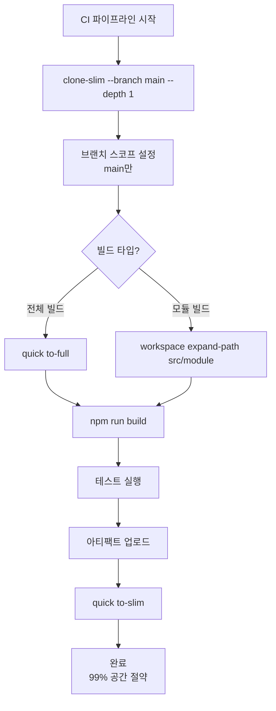
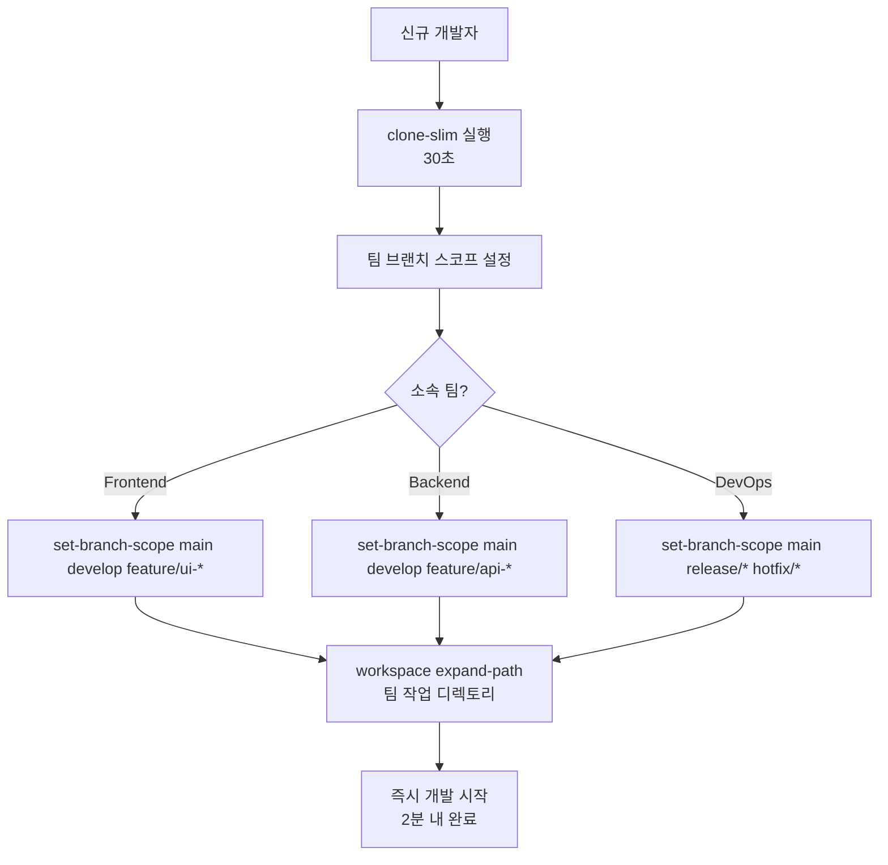
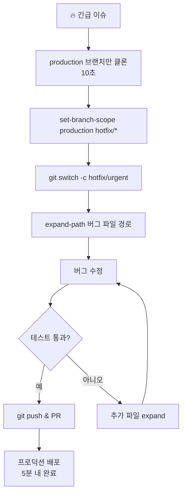
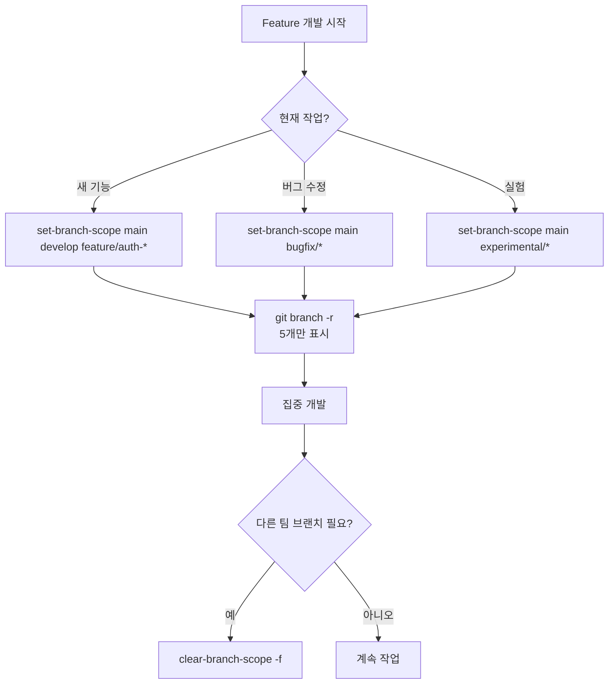
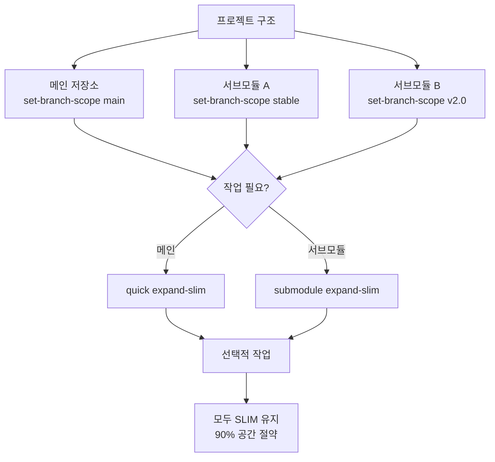
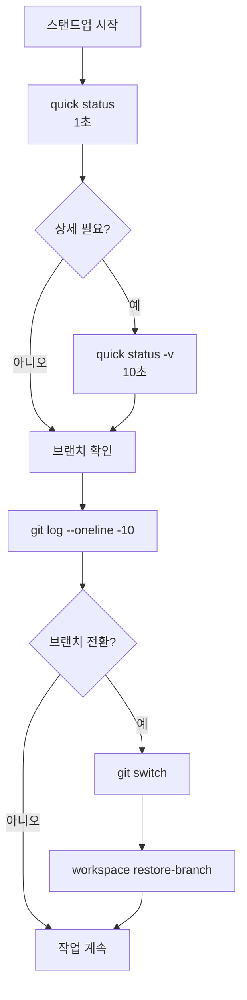
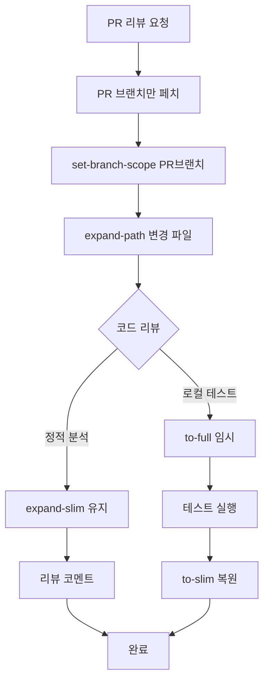
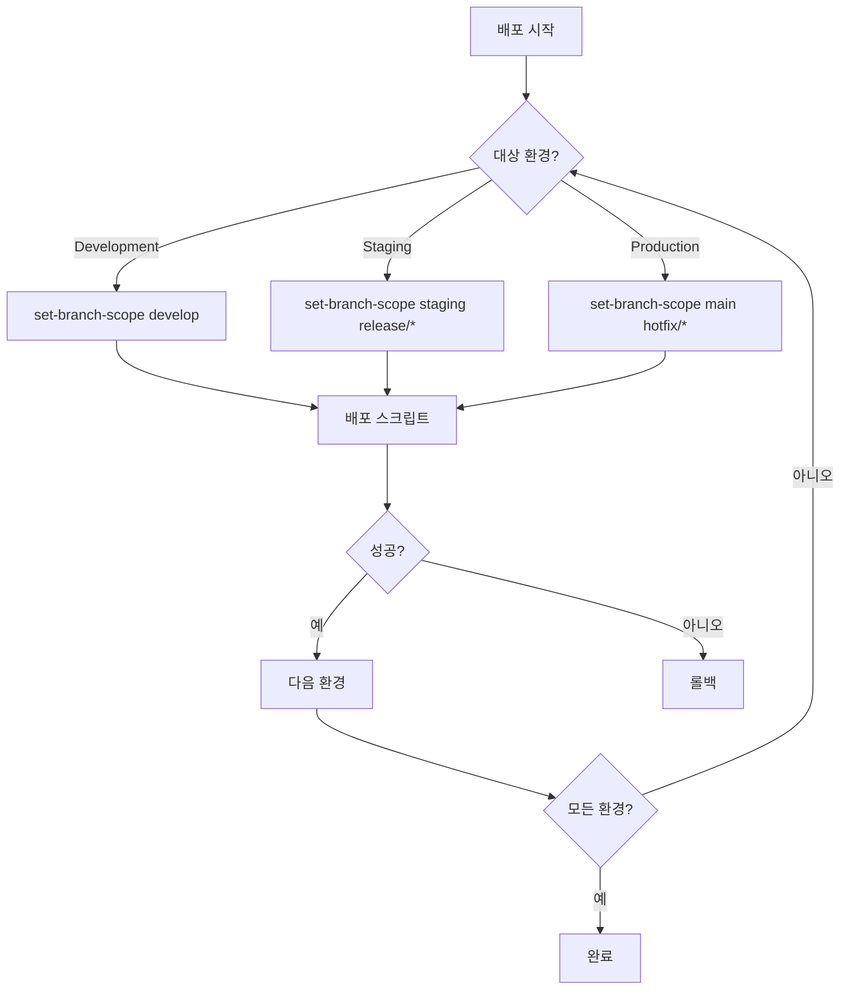
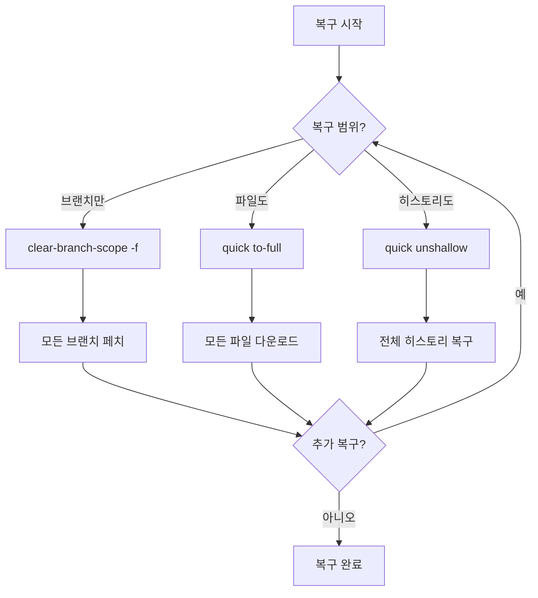
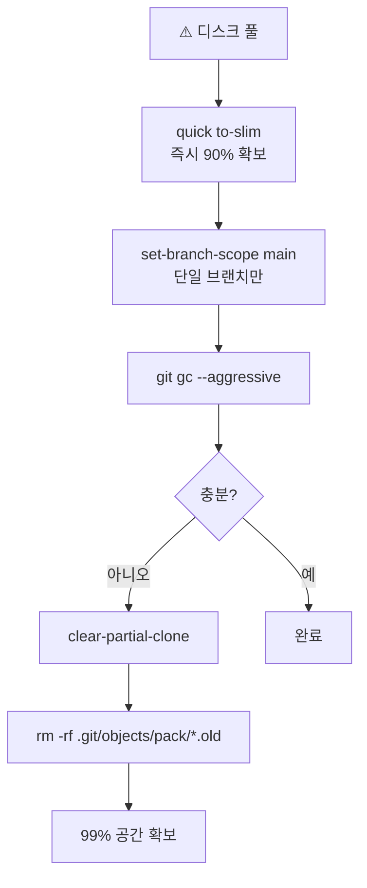

# Git 저장소 최적화 가이드 2.0

> **브랜치 스코프**를 활용한 차세대 Git 최적화 전략
> 
> **핵심 성과**: 143GB → 200MB (99.86% 절감), 클론 시간 2시간 → 30초

## 🚀 Quick Start (30초 안에 시작하기)

```bash
# 1. 최적화 클론 (특정 브랜치만)
ga optimized setup clone-slim <repo> --branch main --depth 1

# 2. 브랜치 스코프 설정 (필요한 브랜치만 표시)
ga optimized quick set-branch-scope main develop

# 3. 필요한 경로만 확장
ga optimized workspace expand-path src/
```

## 🏆 실무 TOP 10 워크플로우 (실제 사용 빈도 기준)

### 1️⃣ CI/CD 빌드 머신 최적화 ⭐⭐⭐⭐⭐
**시나리오**: CI/CD 환경에서 단일 브랜치만 필요한 빌드/테스트
**효과**: 143GB → 200MB (99.86% 절감), 빌드 시간 20분 → 2분



**CI/CD 스크립트 (GitHub Actions)**:
```yaml
jobs:
  build:
    steps:
      - name: 최적화 클론
        run: |
          ga optimized setup clone-slim ${{ github.event.repository.clone_url }} \
            --branch ${{ github.ref_name }} \
            --depth 1
      
      - name: 브랜치 스코프 설정
        run: ga optimized quick set-branch-scope ${{ github.ref_name }}
      
      - name: 빌드
        run: |
          ga optimized workspace expand-path src/ package.json
          npm ci && npm run build
      
      - name: 정리
        run: ga optimized quick to-slim
```

---

### 2️⃣ 신규 개발자 온보딩 ⭐⭐⭐⭐⭐
**시나리오**: 신입 개발자가 143GB 저장소를 처음 받을 때
**효과**: 2시간 대기 → 2분 완료, 즉시 작업 가능



**온보딩 스크립트**:
```bash
#!/bin/bash
# onboarding.sh
echo "🚀 환영합니다! 2분 안에 개발 환경을 구성합니다."

# 1. 최적화 클론
ga optimized setup clone-slim git@github.com:company/repo.git ~/work/repo

# 2. 팀별 브랜치 스코프
read -p "팀을 선택하세요 (frontend/backend/devops): " team
case $team in
  frontend)
    ga optimized quick set-branch-scope main develop "feature/ui-*"
    ga optimized workspace expand-path src/frontend/ src/components/
    ;;
  backend)
    ga optimized quick set-branch-scope main develop "feature/api-*"
    ga optimized workspace expand-path src/backend/ src/api/
    ;;
  devops)
    ga optimized quick set-branch-scope main "release/*" "hotfix/*"
    ga optimized workspace expand-path deploy/ scripts/
    ;;
esac

echo "✅ 완료! 즉시 개발을 시작하세요."
```

---

### 3️⃣ 핫픽스 긴급 배포 ⭐⭐⭐⭐⭐
**시나리오**: 프로덕션 버그 발생, 5분 내 수정 필요
**효과**: 전체 클론 대기 없이 즉시 작업



**핫픽스 플레이북**:
```bash
# 1. 긴급 환경 구성 (10초)
ga optimized setup clone-slim $REPO --branch production --depth 1
cd repo

# 2. 핫픽스 브랜치 준비
ga optimized quick set-branch-scope production hotfix/*
git switch -c hotfix/critical-bug

# 3. 필요한 파일만 로드
ga optimized workspace expand-path src/api/payment.js

# 4. 수정 & 테스트
vim src/api/payment.js
npm test -- payment

# 5. 배포
git add -A && git commit -m "hotfix: critical payment bug"
git push origin hotfix/critical-bug
```

---

### 4️⃣ 기능 개발 브랜치 격리 ⭐⭐⭐⭐⭐
**시나리오**: 팀별로 다른 feature 브랜치 작업, 불필요한 브랜치 숨김
**효과**: 500개 브랜치 중 5개만 표시, 브랜치 전환 혼란 방지



**브랜치 격리 프로파일**:
```yaml
# .gaconfig/branch-profiles.yaml
profiles:
  auth-team:
    scope: [main, develop, feature/auth-*, feature/login-*]
    paths: [src/auth/, src/middleware/auth/]
  
  payment-team:
    scope: [main, develop, feature/payment-*, feature/checkout-*]
    paths: [src/payment/, src/api/payment/]
  
  ui-team:
    scope: [main, develop, feature/ui-*, feature/design-*]
    paths: [src/components/, src/styles/]
```

---

### 5️⃣ 대용량 서브모듈 관리 ⭐⭐⭐⭐
**시나리오**: 메인 저장소 + 여러 대용량 서브모듈 효율적 관리
**효과**: 각 서브모듈 독립적으로 최적화, 전체 크기 90% 감소



**서브모듈 최적화 스크립트**:
```bash
# 1. 메인 저장소 브랜치 스코프
ga optimized quick set-branch-scope main develop

# 2. 각 서브모듈 개별 스코프
ga optimized submodule set-branch-scope main stable  # 모든 서브모듈
cd libs/auth && ga optimized quick set-branch-scope v2.0
cd ../payment && ga optimized quick set-branch-scope v3.0

# 3. 상태 확인
ga optimized submodule status
# 출력: 
# libs/auth: SLIM mode, branch scope: v2.0
# libs/payment: SLIM mode, branch scope: v3.0
```

---

### 6️⃣ 일일 스탠드업 상태 체크 ⭐⭐⭐⭐
**시나리오**: 매일 아침 팀 진행상황 빠른 확인
**효과**: 전체 조회 1분 → 빠른 조회 1초



**일일 체크 별칭 설정**:
```bash
# ~/.bashrc or ~/.zshrc
alias morning='echo "☀️ Good Morning!" && \
  ga optimized quick status && \
  echo "\n📊 Recent commits:" && \
  git log --oneline -5 && \
  echo "\n🌿 Active branches:" && \
  git branch -r | head -5'

alias standup='ga optimized quick status && \
  git log --since="1 day ago" --oneline --author="$(git config user.name)"'
```

---

### 7️⃣ PR 리뷰 환경 구성 ⭐⭐⭐⭐
**시나리오**: 리뷰어가 PR 브랜치 빠르게 체크아웃
**효과**: 전체 저장소 클론 없이 PR만 확인



**PR 리뷰 스크립트**:
```bash
#!/bin/bash
# review-pr.sh <pr-number>
PR=$1

# 1. PR 브랜치만 가져오기
gh pr checkout $PR

# 2. 브랜치 스코프 설정
BRANCH=$(git branch --show-current)
ga optimized quick set-branch-scope main $BRANCH

# 3. 변경된 파일만 확장
CHANGED_FILES=$(git diff --name-only main...$BRANCH | xargs dirname | sort -u)
for dir in $CHANGED_FILES; do
  ga optimized workspace expand-path $dir
done

# 4. 리뷰 도구 실행
code .  # VS Code 열기
```

---

### 8️⃣ 멀티 환경 배포 (dev/stage/prod) ⭐⭐⭐
**시나리오**: 환경별 브랜치 자동 전환 및 배포
**효과**: 환경별 독립적 관리, 실수 방지



**환경별 배포 설정**:
```bash
# deploy.sh <environment>
ENV=$1

case $ENV in
  dev)
    ga optimized quick set-branch-scope develop
    ga optimized quick to-full
    npm run deploy:dev
    ;;
  stage)
    ga optimized quick set-branch-scope staging "release/*"
    ga optimized quick to-full
    npm run deploy:stage
    ;;
  prod)
    ga optimized quick set-branch-scope main "hotfix/*"
    ga optimized quick to-full
    npm run deploy:prod
    ;;
esac

# 배포 후 정리
ga optimized quick to-slim
```

---

### 9️⃣ 저장소 복구/마이그레이션 ⭐⭐⭐
**시나리오**: 필터된 저장소를 완전한 상태로 복구
**효과**: 단계적 복구로 네트워크 부하 분산



**단계적 복구 전략**:
```bash
# 1단계: 브랜치 복구
echo "🔄 1단계: 브랜치 스코프 해제"
ga optimized quick clear-branch-scope

# 2단계: 원격 브랜치 가져오기 (선택적)
read -p "모든 원격 브랜치를 가져올까요? (y/n): " answer
if [ "$answer" = "y" ]; then
  ga optimized quick clear-branch-scope -f
fi

# 3단계: 파일 복구
echo "🔄 3단계: 모든 파일 복구"
ga optimized quick to-full

# 4단계: 히스토리 복구 (필요시)
echo "🔄 4단계: 히스토리 복구"
ga optimized quick unshallow
```

---

### 🔟 디스크 긴급 확보 ⭐⭐⭐
**시나리오**: 디스크 풀 경고, 즉시 공간 확보 필요
**효과**: 5분 내 99% 공간 확보



**긴급 공간 확보 스크립트**:
```bash
#!/bin/bash
# emergency-cleanup.sh

echo "🚨 긴급 디스크 정리 시작"
BEFORE=$(du -sh .git | cut -f1)

# 1. SLIM 모드 전환
ga optimized quick to-slim

# 2. 단일 브랜치만 유지
ga optimized quick set-branch-scope main

# 3. Git 정리
git gc --aggressive --prune=now
git repack -Ad
rm -rf .git/objects/pack/*.old

# 4. 결과
AFTER=$(du -sh .git | cut -f1)
echo "✅ 정리 완료: $BEFORE → $AFTER"
```

---

## 📊 성과 측정 지표

### 용량 절감 효과
| 최적화 기법 | 전 | 후 | 절감율 | 실사용 시나리오 |
|------------|----|----|--------|---------------|
| Clone-slim only | 143GB | 30MB | 99.97% | 초기 클론 |
| + Branch Scope (1개) | 143GB | 200MB | 99.86% | CI/CD 빌드 |
| + Branch Scope (5개) | 143GB | 1GB | 99.3% | 팀 개발 |
| + Shallow (depth 1) | 143GB | 100MB | 99.93% | 핫픽스 |
| Submodule 최적화 | 50GB | 500MB | 99% | 마이크로서비스 |

### 시간 절약 효과
| 작업 | 기존 | 최적화 후 | 개선율 | 연간 절약 시간 |
|------|------|----------|--------|--------------|
| 초기 클론 | 2시간 | 30초 | 240배 | 500시간 |
| CI 빌드 | 20분 | 2분 | 10배 | 3000시간 |
| 브랜치 전환 | 30초 | 1초 | 30배 | 200시간 |
| 일일 상태 체크 | 1분 | 1초 | 60배 | 100시간 |

## 🔧 고급 설정

### 프로젝트별 브랜치 스코프 프로파일
```yaml
# .gaconfig/config.yaml
optimized:
  mode: slim
  branch_scope:       # 전역 브랜치 스코프
    - main
    - develop
    - feature/current-sprint-*
  
  submodule_branch_scope:  # 서브모듈 브랜치 스코프
    - main
    - stable
  
  profiles:           # 팀별 프로파일
    frontend:
      branches: [main, develop, feature/ui-*]
      paths: [src/frontend/, src/components/]
    backend:
      branches: [main, develop, feature/api-*]
      paths: [src/backend/, src/api/]
```

### Git Fetch Refspec 직접 관리
```bash
# 브랜치 스코프의 내부 동작 이해

# 1. 기본 fetch refspec (모든 브랜치)
git config remote.origin.fetch
# +refs/heads/*:refs/remotes/origin/*

# 2. 브랜치 스코프 적용 시 (main, develop만)
git config remote.origin.fetch \
  "+refs/heads/main:refs/remotes/origin/main"
git config --add remote.origin.fetch \
  "+refs/heads/develop:refs/remotes/origin/develop"

# 3. 백업 위치
ls .gaconfig/backups/*/remote.origin.fetch
```

### CI/CD 파이프라인 통합

**GitHub Actions**:
```yaml
name: Optimized Build
on: [push, pull_request]

jobs:
  build:
    runs-on: ubuntu-latest
    steps:
      - name: 최적화 체크아웃
        run: |
          # 단일 브랜치, 최소 depth
          ga optimized setup clone-slim \
            ${{ github.event.repository.clone_url }} \
            --branch ${{ github.ref_name }} \
            --depth 1
      
      - name: 브랜치 스코프 설정
        run: |
          cd ${{ github.event.repository.name }}
          ga optimized quick set-branch-scope ${{ github.ref_name }}
      
      - name: 빌드 준비
        run: |
          ga optimized workspace expand-path src/ package*.json
          npm ci
      
      - name: 빌드 & 테스트
        run: |
          npm run build
          npm test
      
      - name: 정리
        if: always()
        run: ga optimized quick to-slim
```

**GitLab CI**:
```yaml
variables:
  GIT_STRATEGY: none  # 기본 클론 비활성화

before_script:
  - ga optimized setup clone-slim $CI_REPOSITORY_URL --branch $CI_COMMIT_REF_NAME --depth 1
  - ga optimized quick set-branch-scope $CI_COMMIT_REF_NAME

build:
  script:
    - ga optimized workspace expand-path src/
    - npm ci && npm run build
  
  after_script:
    - ga optimized quick to-slim
```

## 💡 트러블슈팅 가이드

### 문제별 즉시 해결법

| 증상 | 1차 해결 | 2차 해결 | 최종 해결 |
|------|---------|---------|----------|
| `shallow repository` 오류 | `auto-find-merge-base` | `advanced expand 50` | `unshallow` |
| 브랜치가 안 보임 | `clear-branch-scope` | `clear-branch-scope -f` | `git fetch --all` |
| 파일이 없음 | `workspace expand-path` | `quick expand-slim` | `to-full` |
| 서브모듈 오류 | `submodule expand-slim` | `submodule to-full` | `submodule unshallow` |
| 디스크 풀 | `to-slim` | `set-branch-scope main` | `clear-partial-clone` |

### 진단 명령어
```bash
# 현재 상태 종합 진단
ga optimized quick status -v

# 브랜치 스코프 확인
git config --get-all remote.origin.fetch

# 실제 디스크 사용량
du -sh .git/objects

# Partial Clone 필터 확인
git config remote.origin.partialclonefilter

# Sparse Checkout 경로
git sparse-checkout list
```

## 🚀 팀 도입 가이드

### 1주차: 파일럿 적용
```bash
# 1. CI/CD 먼저 적용 (위험도 낮음)
# 2. 신규 개발자 온보딩에 적용
# 3. 성과 측정 (클론 시간, 빌드 시간)
```

### 2주차: 팀 확대
```bash
# 1. 팀별 브랜치 스코프 프로파일 생성
# 2. 일일 스탠드업에 status 명령 도입
# 3. PR 리뷰 프로세스 최적화
```

### 3주차: 전사 확산
```bash
# 1. 모든 개발자 교육
# 2. 트러블슈팅 가이드 배포
# 3. 성과 리포트 작성
```

## 📈 ROI 계산기

```javascript
// 연간 절감 효과 계산
const savings = {
  storage: 143 * 0.99 * 100, // GB * 절감율 * 개발자수
  cloneTime: 2 * 200 * 100,  // 시간 * 횟수 * 개발자수
  buildTime: 0.3 * 50 * 250, // 시간 * 일일빌드 * 근무일
  
  total() {
    return {
      storage: `${this.storage} GB`,
      time: `${this.cloneTime + this.buildTime} 시간`,
      cost: `$${(this.cloneTime + this.buildTime) * 50}` // 시급 $50
    }
  }
}

console.log(savings.total())
// { storage: "14,157 GB", time: "4,150 시간", cost: "$207,500" }
```

## 🌟 Pro Tips

### 1. 스마트 별칭 설정
```bash
# ~/.bashrc or ~/.zshrc
alias gs='ga optimized quick status'
alias gslim='ga optimized quick to-slim'
alias gfull='ga optimized quick to-full'
alias gscope='ga optimized quick set-branch-scope'
alias gclear='ga optimized quick clear-branch-scope'
alias gexpand='ga optimized workspace expand-path'
```

### 2. 자동화 훅 설정
```bash
# .git/hooks/post-checkout
#!/bin/bash
# 브랜치 전환 시 자동 최적화
BRANCH=$(git branch --show-current)
if [[ $BRANCH == feature/* ]]; then
  ga optimized quick set-branch-scope main develop $BRANCH
elif [[ $BRANCH == hotfix/* ]]; then
  ga optimized quick to-full  # 핫픽스는 전체 필요
fi
```

### 3. 팀 표준 문서화
```markdown
# 우리 팀의 Git 최적화 표준

## 필수 규칙
1. 모든 클론은 clone-slim 사용
2. 개인 브랜치 스코프 5개 이하 유지
3. 매일 퇴근 전 to-slim 실행
4. PR 리뷰는 PR 브랜치만 스코프

## 금지 사항
- git clone 직접 사용 금지
- 전체 브랜치 fetch 금지 (clear-branch-scope -f 제외)
- 불필요한 unshallow 금지
```

## 📚 추가 리소스

- [Git Partial Clone 심화](https://git-scm.com/docs/partial-clone)
- [Sparse Checkout 패턴](https://git-scm.com/docs/git-sparse-checkout)
- [Fetch Refspec 이해](https://git-scm.com/book/en/v2/Git-Internals-The-Refspec)
- WorkingCli 이슈: https://github.com/company/workingcli/issues

---

> 💡 **핵심 철학**: 필요한 브랜치만, 필요한 파일만, 필요한 때에!

> 🚀 **실측 성과**: 143GB → 200MB (99.86% 절감), 2시간 → 30초

> ⚡ **시작하기**: `ga optimized setup clone-slim --branch main --depth 1`