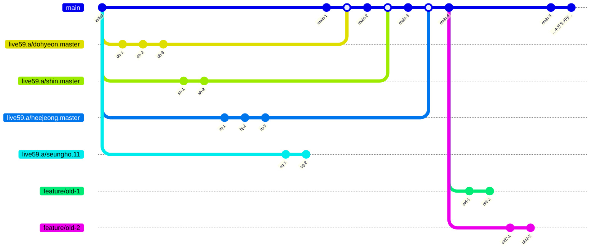
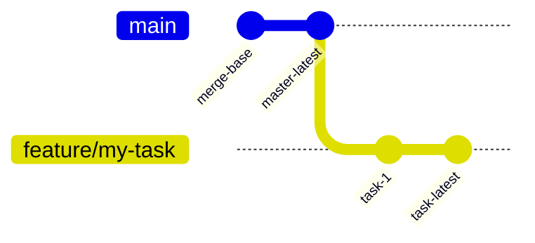
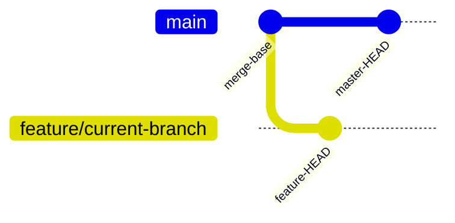
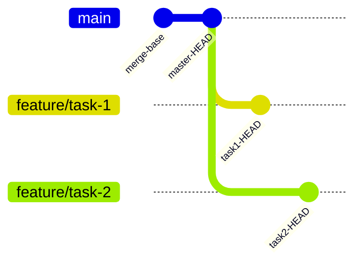
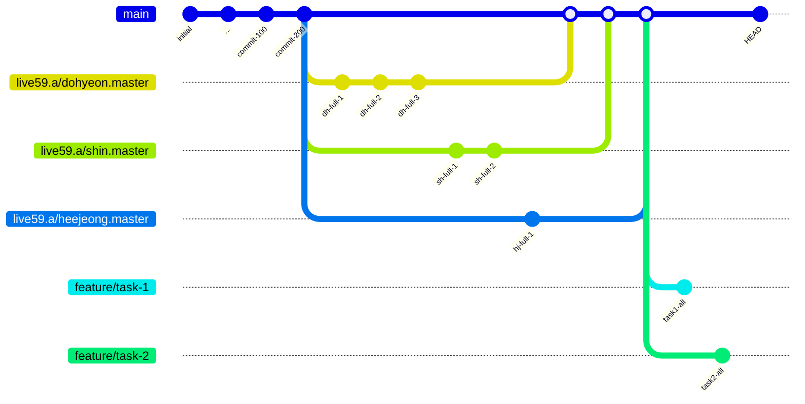

# Git 최적화 워크플로우 실무 가이드 (ga opt)

> 대규모 프로젝트에서 저장소 공간을 최적화하고 작업 효율을 극대화하는 실전 Git 워크플로우

## 🎯 핵심 철학
- **저장소 공간 최소화**: 필요한 브랜치와 히스토리만 유지
- **작업 효율 극대화**: 빠른 전환과 선택적 로딩
- **기존 Git 호환성**: 표준 Git 명령과 완벽 호환

## 🚀 핵심 명령어 TOP 10

### 1. `ga opt quick shallow [depth]`
### 2. `ga opt quick set-branch-scope`
### 3. `ga opt quick status`
### 4. `ga opt setup clone [repo_url] [repo_path]`
### 5. `ga opt setup performance`
### 6. `ga opt quick auto`
### 7. `ga opt quick unshallow`
### 8. `ga opt quick clear-branch-scope`
### 9. `ga opt submodule shallow [depth]`
### 10. `ga opt submodule set-branch-scope`

## 📊 실무 워크플로우 시나리오

### 📈 최적화 전 상태 (79GB 저장소)
> 참고: Mermaid 차트에서 `main`은 실제 `master` 브랜치를 의미합니다.



### 1️⃣ 프로젝트 초기 설정
**상황**: 새 프로젝트를 클론하거나 기존 저장소를 최적화할 때

```bash
# 옵션 1: 최적화된 클론 (master만, shallow 1)
ga opt setup clone https://github.com/user/repo.git my-project

# 옵션 2: 기존 저장소 최적화
# 1. 작업할 브랜치만 노출 (main + 작업 브랜치)
ga opt quick set-branch-scope master feature/my-task
ga opt submodule set-branch-scope master feature/my-task

# 2. 최신 커밋 1개만 유지 (95% 공간 절약)
ga opt quick shallow 1
ga opt submodule shallow 1

# 3. merge-base 자동 설정
ga opt quick auto master feature/my-task
```

**최적화 후 Git 히스토리:**


**효과**: 10GB → 500MB, Clone 시간 10분 → 30초

### 2️⃣ 작업 중 정리/최적화
**상황**: 작업 중 저장소가 커져서 다시 정리가 필요할 때

```bash
# 1. 히스토리 재정리 (최신 1개만)
ga opt quick shallow 1
ga opt submodule shallow 1

# 2. merge-base만 유지
ga opt quick auto master feature/current-branch
```

**최적화 후 Git 히스토리 (shallow 1 + merge-base):**


**효과**: 불필요한 히스토리 제거, 빠른 작업 환경 유지

### 3️⃣ 브랜치 추가 작업
**상황**: 다른 브랜치를 추가로 작업해야 할 때

```bash
# 1. 새 브랜치 포함하여 scope 재설정
ga opt quick set-branch-scope master feature/task-1 feature/task-2
ga opt submodule set-branch-scope master feature/task-1 feature/task-2

# 2. 최신 커밋만 유지
ga opt quick shallow 1
ga opt submodule shallow 1

# 3. 모든 로컬 브랜치 merge-base 설정
ga opt quick auto master feature/task-1 feature/task-2
```

**최적화 후 Git 히스토리 (3개 브랜치 + merge-base):**


**효과**: 필요한 브랜치만 효율적으로 관리

### 4️⃣ 전체 복원 (필요시)
**상황**: 전체 히스토리나 모든 브랜치가 필요할 때

```bash
# 1. 브랜치 스코프 해제 (모든 브랜치 표시)
ga opt quick clear-branch-scope
ga opt submodule clear-branch-scope

# 2. 전체 히스토리 복원 (⚠️ 용량 주의!)
ga opt quick unshallow
# submodule은 필요시에만: ga opt submodule unshallow
```

**복원 후 Git 히스토리 (모든 브랜치와 전체 히스토리):**


**효과**: 완전한 저장소 복원, 모든 브랜치와 히스토리 접근 가능

## 🔧 설치 및 Alias 설정

### ga를 git으로 대체하여 사용하기

**macOS / Linux (bash/zsh)**
```bash
# ~/.bashrc 또는 ~/.zshrc에 추가
alias git='ga'

# 즉시 적용
source ~/.bashrc  # 또는 source ~/.zshrc
```

**Windows (PowerShell)**
```powershell
# $PROFILE 파일에 추가 (없으면 생성)
New-Alias -Name git -Value ga

# 프로필 위치 확인
$PROFILE

# 프로필 편집
notepad $PROFILE
```

**Windows (Git Bash)**
```bash
# ~/.bashrc에 추가
alias git='ga'

# 즉시 적용
source ~/.bashrc
```

**효과**: 
- 모든 `git` 명령이 자동으로 `ga`로 실행
- 기존 Git 워크플로우 그대로 유지
- `git opt` 명령으로 최적화 기능 사용 가능